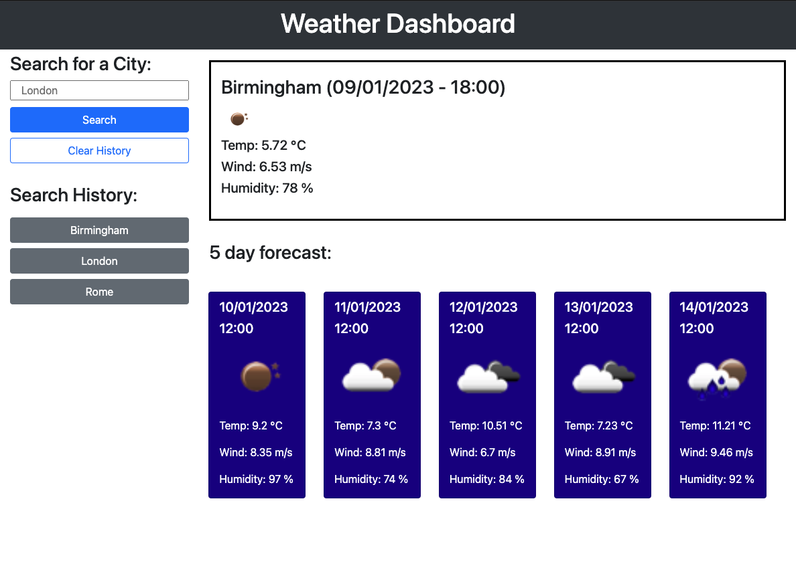

# Weather-Dashboard
5-day weather forecast for a given city.

## Description

**Front-End Web Development Bootcamp - Module 8 Challenge**

This Weather Dashboard provides a 5-day weather forecast for a city of your choosing.  It also has a persistent search history. 

## Installation

No need to install, simply visit:  **https://rgbrain.github.io/Weather-Dashboard/**

## Usage

Having visited https://rgbrain.github.io/Weather-Dashboard/, enter a city name in the search field and click the 'Search' button.  You will then be presented with the temperature/wind speed/hudity for that city currently\* along with a 5 day forecast\**.

There is a search history listed, you can simply click on any of these buttons to search once again for that city.  In addition, I have added a 'Clear History' button which does exactly what it says.

\* - The OpenWeather API only provides weather data at set 3-hour increments (00:00, 03:00, 06:00, 09:00, 12:00, 15:00, 18:00, 21:00), it doesn't actually provide the current weather on this API.  As such, the main weather information provided is for the closest data-point in the future eg. if it's 02:00, then the 'current' weather shown will be for 03:00.  I have included times on the page so that this is clear.

\** - NB. 5 day weather forecast is for 12:00 GMT each day, regardless of the location of the city.

**SCREENSHOT**

   

## Credits

University of Birmingham - Front-End Web-Dev Bootcamp

## License

MIT License

Copyright (c) [2023] [Richard Brain]

Permission is hereby granted, free of charge, to any person obtaining a copy
of this software and associated documentation files (the "Software"), to deal
in the Software without restriction, including without limitation the rights
to use, copy, modify, merge, publish, distribute, sublicense, and/or sell
copies of the Software, and to permit persons to whom the Software is
furnished to do so, subject to the following conditions:

The above copyright notice and this permission notice shall be included in all
copies or substantial portions of the Software.

THE SOFTWARE IS PROVIDED "AS IS", WITHOUT WARRANTY OF ANY KIND, EXPRESS OR
IMPLIED, INCLUDING BUT NOT LIMITED TO THE WARRANTIES OF MERCHANTABILITY,
FITNESS FOR A PARTICULAR PURPOSE AND NONINFRINGEMENT. IN NO EVENT SHALL THE
AUTHORS OR COPYRIGHT HOLDERS BE LIABLE FOR ANY CLAIM, DAMAGES OR OTHER
LIABILITY, WHETHER IN AN ACTION OF CONTRACT, TORT OR OTHERWISE, ARISING FROM,
OUT OF OR IN CONNECTION WITH THE SOFTWARE OR THE USE OR OTHER DEALINGS IN THE
SOFTWARE.

---

